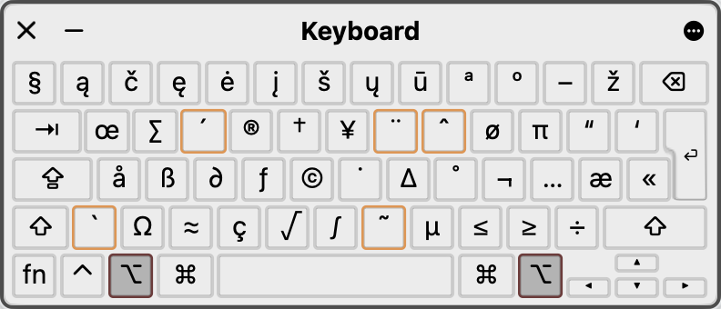
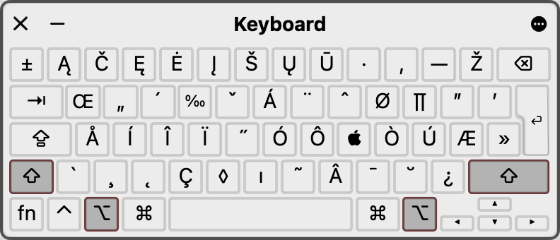

# U.S. keyboard with Lithuanian letters for Mac

**The U.S. - Lithuanian keyboard layout** is intended for developers who primarily use the *U.S. layout* but also need to type in **Lithuanian** for communication. It adjusts the standard U.S. English keyboard to include Lithuanian characters, which can be accessed via the `⌥ option` key modifier.

- `option` + `1` => `ą`
- `option` + `2` => `č`
- `option` + `3` => `ę`
- `option` + `4` => `ė`
- `option` + `5` => `į`
- `option` + `6` => `š`
- `option` + `7` => `ų`
- `option` + `8` => `ū`
- `option` + `=` => `ž`
- `option` + `shift` + `1` => `Ą`
- `option` + `shift` + `2` => `Č`
- `option` + `shift` + `3` => `Ę`
- `option` + `shift` + `4` => `Ė`
- `option` + `shift` + `5` => `Į`
- `option` + `shift` + `6` => `Š`
- `option` + `shift` + `7` => `Ų`
- `option` + `shift` + `8` => `Ū`
- `option` + `shift` + `=` => `Ž`

## Installation

1. Copy the `.keylayout` file to `/Library/Keyboard Layouts`.

    ```bash
    sudo curl -L \
            -o '/Library/Keyboard Layouts/us-lithuanian.keylayout' \
            'https://raw.githubusercontent.com/mantasgh/us-lithuanian-keyboard/main/us-lithuanian.keylayout'
    ```

2. Restart your computer or log out and log back in.
3. Go to *System Settings > Keyboard > Input Sources > Edit... > [+] > Others*.
4. Add the **U.S. - Lithuanian** keyboard layout.

## Preview

U.S. layout:<br />

Lithuanian lower case letters with `⌥ option` modifier:<br />

Lithuanian upper case letters with `⌥ option` + `⇧ shift` modifiers:<br />

## Other

Created using [Ukelele](https://software.sil.org/ukelele/).
